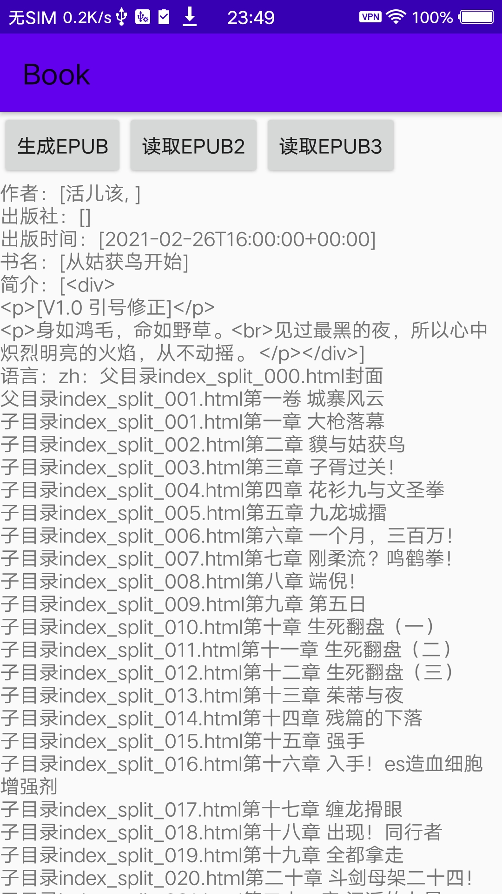
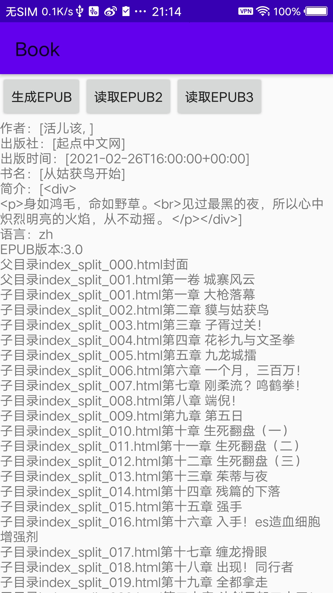

# EpubLib

Una biblioteca para Android para leer, escribir y manipular archivos EPUB, con mejoras basadas en [epublib](https://github.com/psiegman/epublib) y [epub4j](https://github.com/documentnode/epub4j)

En comparación con las versiones originales de epublib y epub4j, esta implementación incluye los siguientes cambios:
* Convertida a una biblioteca exclusiva para Android, por lo que solo funciona en Android.
* Se eliminó la dependencia de kxml2, ya que no es necesaria en Android.
* Se agregó soporte para EPUB 3.x.
*  ~~Se actualizó jzlib a la última versión.~~ Se utiliza directamente JDK para ZIP.

## Uso

        // Leer epub
        EpubReader reader = new EpubReader();
        InputStream in = getAssets().open(name);
        //InputStream in= new FileInputStream(new File(filepath));
        Book book = reader.readEpub(in);
        
        // Obtener la versión del archivo epub
        String epubVersion=book.getVersion()
        
        // Obtener información del archivo epub
        Metadata metadata = book.getMetadata();
        String bookInfo = "Autor: " + metadata.getAuthors()+
                            "\nEditorial: " + metadata.getPublishers()+
                            "\nFecha de publicación: " + metadata.getDates()+
                            "\nTítulo: " + metadata.getTitles()+
                            "\nDescripción: " + metadata.getDescriptions()+
                            "\nIdioma: " + metadata.getLanguage()+
                            "\n";
        
        

       // Obtener el menú de lectura lineal
        List<Resource> spineReferences = book.getTableOfContents().getAllUniqueResources();
        for(Resource sp:spineReferences){
            Log.d(TAG,sp.getHref()+sp.getTitle());
        }

        // Obtener el menú jerárquico
        List<TOCReference> tocReferences =book.getTableOfContents().getTocReferences();
        for (TOCReference top:tocReferences){
            Resource topres= top.getResource();
            Log.d(TAG,"Directorio principal: "+topres.getHref()+topres.getTitle());
            if (top.getChildren().size()>0){
                for (TOCReference child:top.getChildren()){
                    Resource childres= child.getResource();
                    Log.d(TAG,"Subdirectorio: "+childres.getHref()+childres.getTitle());
                }
            }
        }

### EPUB2 y EPUB3

