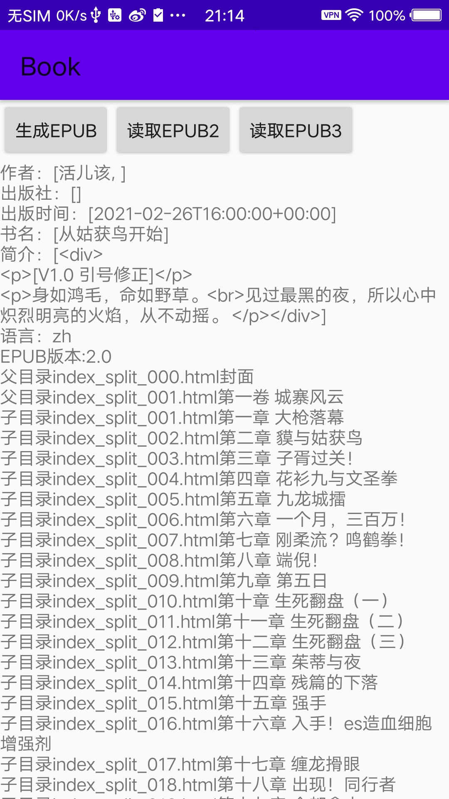

# EpubLib

A Android library for reading/writing/manipulating EPUB files, with improvements based on [epublib](https://github.com/psiegman/epublib). and [epub4j](https://github.com/documentnode/epub4j)

Comparing to the original epublib and epub4j, we contains the following changes:
* Switched to Android library only work in Android.
* Removed the dependency of kxml2,not need for Android.
* Add support of EPUB 3.x.
*  ~~Upgrade jzlib to last version.~~ Just use JDK for ZIP.

## 使用方法

        //读取epub
        EpubReader reader = new EpubReader();
        InputStream in = getAssets().open(name);
        //InputStream in= new FileInputStream(new File(filepath));
        Book book = reader.readEpub(in);
        
        //获取epub文件版本
        String epubVersion=book.getVersion()
        
        //获取epub文件信息
        Metadata metadata = book.getMetadata();
        String bookInfo = "作者："+metadata.getAuthors()+
                            "\n出版社："+metadata.getPublishers()+
                            "\n出版时间：" +metadata.getDates()+
                            "\n书名："+metadata.getTitles()+
                            "\n简介："+metadata.getDescriptions()+
                            "\n语言："+metadata.getLanguage()+
                            "\n";
        
        

       //获取线性的阅读菜单
        List<Resource> spineReferences = book.getTableOfContents().getAllUniqueResources();
        for(Resource sp:spineReferences){
            Log.d(TAG,sp.getHref()+sp.getTitle());
        }

        //获取层级的菜单
        List<TOCReference> tocReferences =book.getTableOfContents().getTocReferences();
        for (TOCReference top:tocReferences){
            Resource topres= top.getResource();
            Log.d(TAG,"父目录"+topres.getHref()+topres.getTitle());
            if (top.getChildren().size()>0){
                for (TOCReference child:top.getChildren()){
                    Resource childres= child.getResource();
                    Log.d(TAG,"子目录"+childres.getHref()+childres.getTitle());
                }
            }
        }

### EPUB2 and EPUB3

